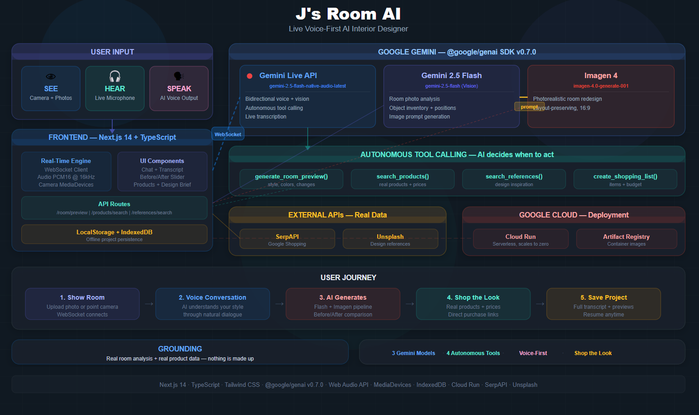

# J's Room AI — Live AI Interior Designer

A voice-first AI interior designer that sees your room, talks to you about redesigning it, generates photorealistic previews, and helps you shop for everything — all in real-time.

**Category:** Live Agents | **Hackathon:** Gemini Live Agent Challenge



---

## Quick Start

### Prerequisites
- Node.js 18+
- npm

### 1. Clone & Install

```bash
git clone https://github.com/jyotiduhan2004/J-s-Room-AI.git
cd J-s-Room-AI/frontend
npm install
```

### 2. Set Up API Keys

Create a `.env.local` file inside the `frontend/` folder:

```env
# Required — Gemini API key (get from https://aistudio.google.com/apikey)
NEXT_PUBLIC_GEMINI_API_KEY=your_gemini_api_key

# Required — SerpAPI key for product search (get from https://serpapi.com/manage-api-key)
SERPAPI_KEY=your_serpapi_key

# Required — Unsplash API key for design references (get from https://unsplash.com/developers)
UNSPLASH_ACCESS_KEY=your_unsplash_access_key
```

**How to get each key:**

| Key | Where to get it | Free tier |
|-----|----------------|-----------|
| `NEXT_PUBLIC_GEMINI_API_KEY` | [Google AI Studio](https://aistudio.google.com/apikey) | Yes — generous free quota |
| `SERPAPI_KEY` | [SerpAPI Dashboard](https://serpapi.com/manage-api-key) | 100 searches/month free |
| `UNSPLASH_ACCESS_KEY` | [Unsplash Developers](https://unsplash.com/developers) | 50 requests/hour free |

### 3. Run

```bash
npm run dev
```

Open [http://localhost:3000](http://localhost:3000) in your browser.

**Important:** Allow microphone and camera access when prompted — the app needs both for the voice + vision experience.

---

## How It Works

1. **Show your room** — Upload a photo or point your camera
2. **Talk to the AI** — Have a natural voice conversation about your design preferences
3. **See the redesign** — AI generates a photorealistic preview with before/after comparison
4. **Shop the look** — AI finds matching products from Indian retailers with real prices
5. **Save & resume** — Projects persist locally, come back anytime

## Tech Stack

| Layer | Technology |
|-------|-----------|
| Frontend | Next.js 14, TypeScript, Tailwind CSS |
| AI Models | Gemini Live API, Gemini 2.5 Flash, Imagen 4 |
| SDK | `@google/genai` v0.7.0 |
| Audio | Web Audio API (PCM16 @ 16kHz) |
| Video | MediaDevices API (live camera) |
| Storage | IndexedDB + LocalStorage |
| External APIs | SerpAPI (Google Shopping), Unsplash |
| Hosting | Google Cloud Run |

## Gemini Models Used

| Model | Purpose |
|-------|---------|
| `gemini-2.5-flash-native-audio-latest` | Real-time voice conversation + vision + autonomous tool calling |
| `gemini-2.5-flash` | Room photo analysis + image prompt generation |
| `imagen-4.0-generate-001` | Photorealistic room redesign generation |

## Project Structure

```
frontend/
├── src/
│   ├── app/
│   │   ├── page.tsx              # Main app — landing + active workspace
│   │   ├── layout.tsx            # Root layout + session provider
│   │   ├── projects/             # Saved projects list + detail pages
│   │   └── api/
│   │       ├── room/preview/     # 2-step generation: Flash → Imagen
│   │       ├── products/search/  # SerpAPI Google Shopping
│   │       └── references/search/# Unsplash design references
│   ├── components/
│   │   ├── AppShell.tsx          # Header, nav, session timer
│   │   ├── CameraFeed.tsx        # Live camera PiP with snap
│   │   ├── ChatPanel.tsx         # Voice transcript display
│   │   ├── BeforeAfterSlider.tsx # Room comparison slider
│   │   ├── ProductGallery.tsx    # Shopping results grid
│   │   ├── DesignBrief.tsx       # Design choices tracker
│   │   └── ...
│   ├── lib/
│   │   ├── gemini-live.ts        # Gemini Live API WebSocket client
│   │   ├── audio-streamer.ts     # PCM16 audio recording + playback
│   │   └── storage.ts            # IndexedDB + LocalStorage persistence
│   └── context/
│       └── SessionContext.tsx     # Global session state
├── .env.local                    # API keys (create this)
└── package.json
```

## Reproducible Testing Instructions

Follow these steps to test J's Room AI end-to-end:

### Step 1: Setup (2 minutes)
```bash
git clone https://github.com/jyotiduhan2004/J-s-Room-AI.git
cd J-s-Room-AI/frontend
npm install
```

Create `frontend/.env.local` with your API keys (see "Set Up API Keys" section above).

```bash
npm run dev
```
Open http://localhost:3000 — allow **microphone** and **camera** access when prompted.

### Step 2: Test Voice Conversation
1. Click **"Start Session"** on the landing page
2. **Upload a room photo** (drag-drop or click upload) — any bedroom/living room photo works
3. **Speak naturally** — say something like *"Hi, I want to redesign this room in a modern minimalist style"*
4. The AI will **respond with voice** and ask follow-up questions about colors, furniture, budget, etc.
5. Continue the conversation — the AI adapts based on your answers

### Step 3: Test Room Redesign Generation
1. After discussing preferences, the AI will **autonomously call the generate tool**
2. Or say: *"Can you generate a preview of the redesign?"*
3. A **photorealistic redesigned room** appears with a **before/after comparison slider**
4. The original layout is preserved — furniture positions stay the same

### Step 4: Test Product Search
1. Say: *"Can you find me a sofa like the one in the design?"*
2. The AI **autonomously searches Indian retailers** via SerpAPI
3. Results show **real products** with INR prices, ratings, and purchase links

### Step 5: Test Project Persistence
1. Navigate to **/projects** — your session is saved automatically
2. Close the browser, reopen — your project is still there (IndexedDB + LocalStorage)

### What to Expect
- **Voice latency:** ~1-2 seconds for AI response (depends on network)
- **Image generation:** ~10-15 seconds for photorealistic preview
- **Product search:** ~3-5 seconds for shopping results
- **Browser support:** Chrome/Edge recommended (best Web Audio API support)

---

## Google Cloud Deployment

The app is deployed on **Google Cloud Run** as a containerized Next.js application.

```bash
# Build and deploy to Cloud Run
gcloud run deploy js-room-ai \
  --source ./frontend \
  --region us-central1 \
  --allow-unauthenticated \
  --set-env-vars "NEXT_PUBLIC_GEMINI_API_KEY=xxx,SERPAPI_KEY=xxx,UNSPLASH_ACCESS_KEY=xxx"
```

---

Built for the [Gemini Live Agent Challenge](https://devpost.com/) #GeminiLiveAgentChallenge
